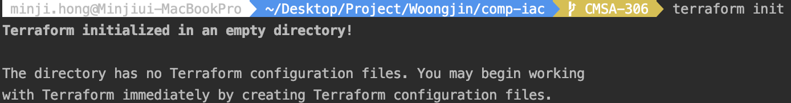
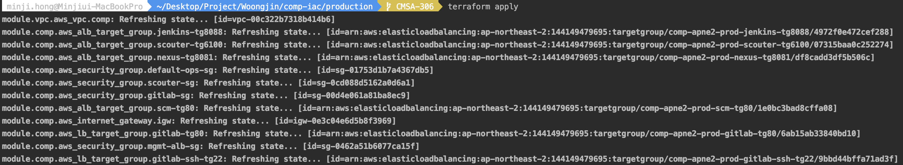

## **Build**
#### 웅진 프로젝트 중 하나인 `comp-iac` 프로젝트를 기반으로 git checkout부터 terraform apply까지의 절차가 기술되어 있습니다.
---
### **1. checkout**  
```console
/* make directory */
$ cd ~
$ mkdir workspace
$ cd workspace

/* git clone */
$ git clone https://github.com/pe-woongjin/comp-iac.git
$ cd ~/workspace/comp-iac
```
---
>
>
### **2. Terraform Build**
#### init
> 테라폼 프로젝트 및 최신 플러그인 초기 설정을 진행합니다. 
```console
terraform init
```

>
#### plan
> 어떤 리소스가 생성, 수정, 삭제될지 계획을 보여줍니다.
```console
terraform plan
```

>
#### apply
> 실제 .tf 파일의 내용대로 리소스를 생성, 수정, 삭제하는 일을 적용합니다.
```console
terraform apply
```
