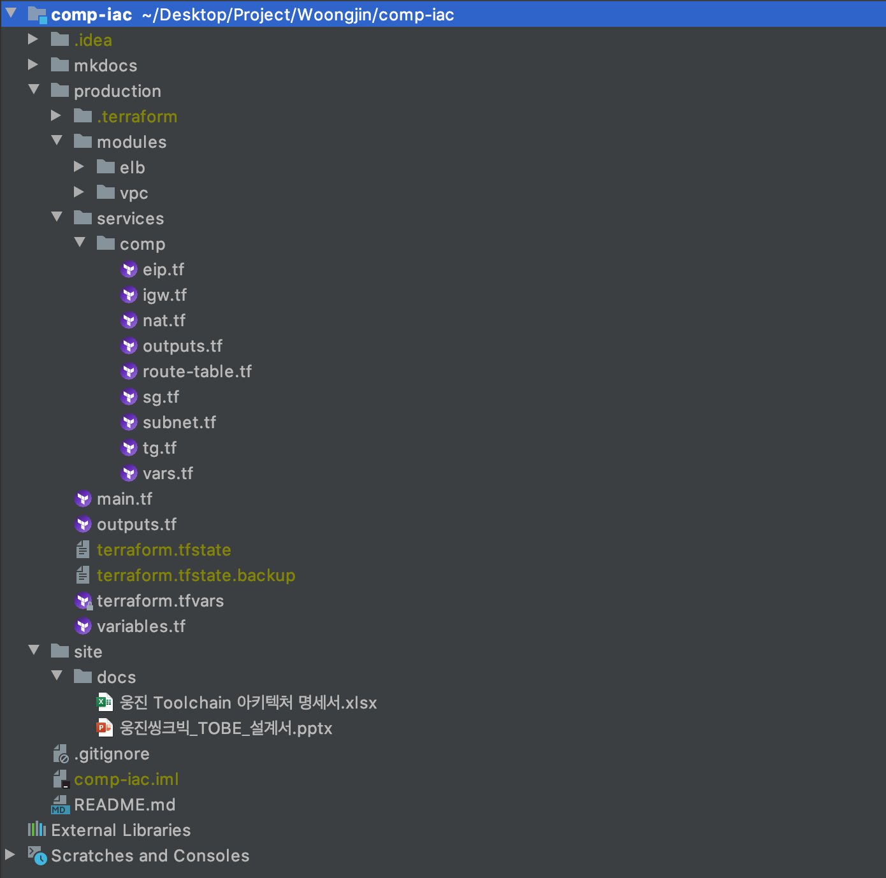

## **Directory** 
#### 웅진 프로젝트 중, comp-iac의 디렉토리 구조입니다.

---
### **1. mkdocs-manual**
> 매뉴얼 가이드 폴더  
> mkdocs 마크다운 방식으로 글쓰기를 하며, `mkdocs serve`라는 명령어를 통해서 실시간으로 매뉴얼 내역을 확인할 수 있습니다. ([mkdocs.org](https://www.mkdocs.org) 참고)  
>
### **2. production** 
> production 환경에서의 구조를 의미합니다.
>> - modules  
>>> comp-iac 프로젝트에서의 **공통 모듈**에 속하는 resource로, `elb`와 `vpc`가 위치합니다.   
>> - services  
>>> comp-iac 프로젝트에서를 구성하는 **리소스**가 위치합니다.  
>
### **3. site**
> 웅진 프로젝트의 아키텍처 명세서 및 설계 문서가 존재합니다.