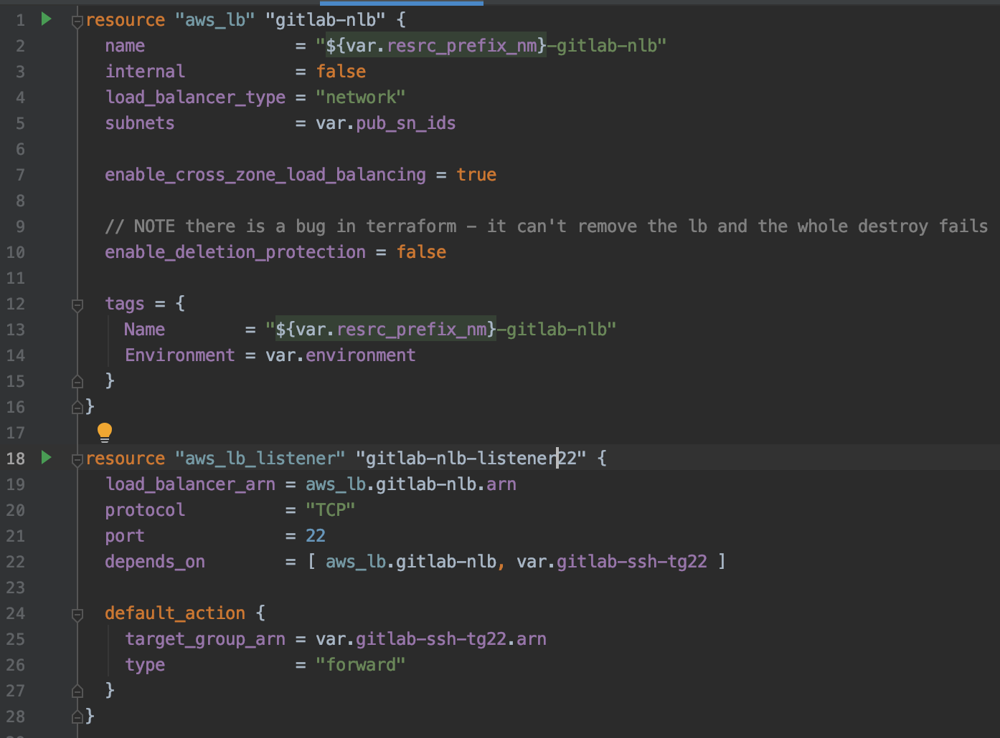
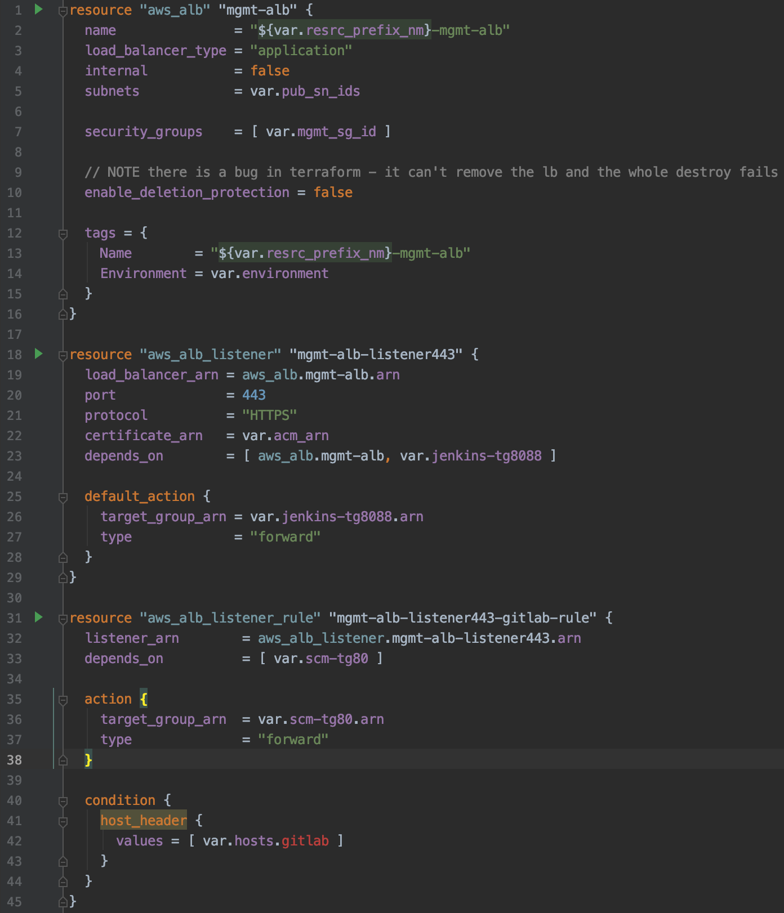
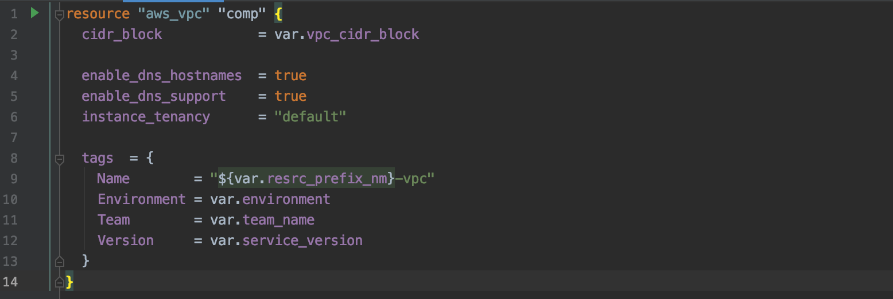
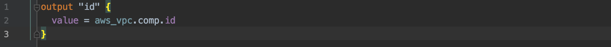

## **Module**
#### comp-iac 프로젝트에서 **공통 모듈(반드시 필요한 요소)**에 속하는 resource로, `elb`와 `vpc`가 위치합니다.
---
### 1. ELB  
> `nlb.tf`, `alb.tf`와 각각에 해당하는 `vars.tf`로 구성됩니다.
>> - gitlab-nlb.tf

>
>> - mgmt-alb.tf

>
### 2. VPC  
> `vpc.tf`와 vpc에 사용되는 `vars.tf`, 다른 모듈 및 리소스에서 사용할 수 있게 정의해둔 `output.tf`로 구성됩니다.
>> - vpc.tf

>> - output.tf
 