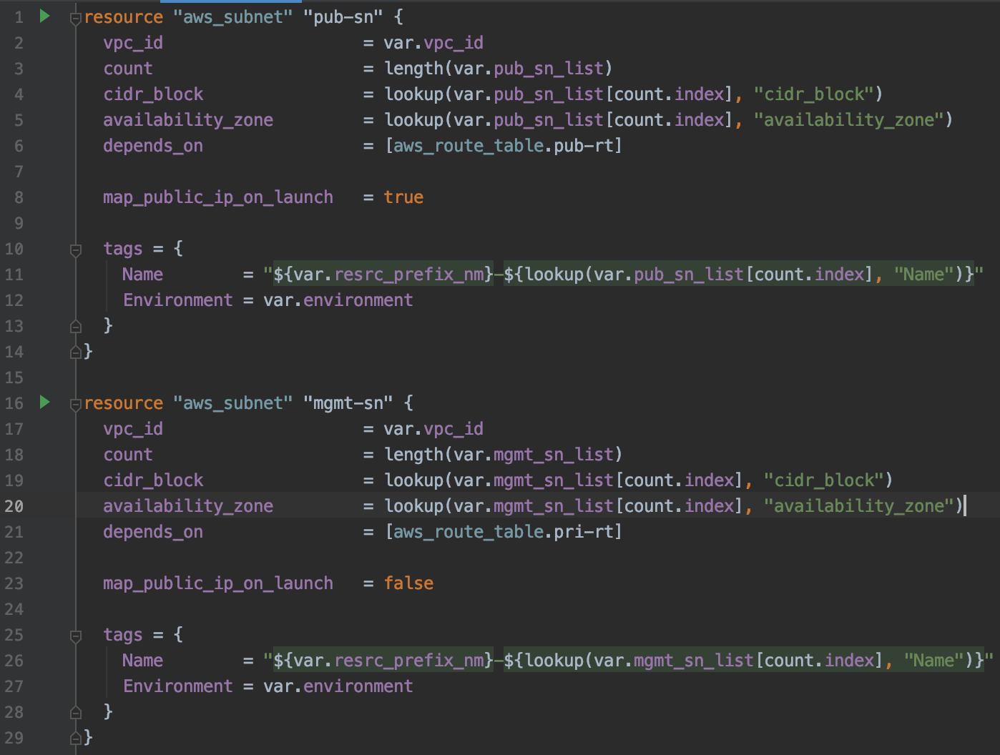
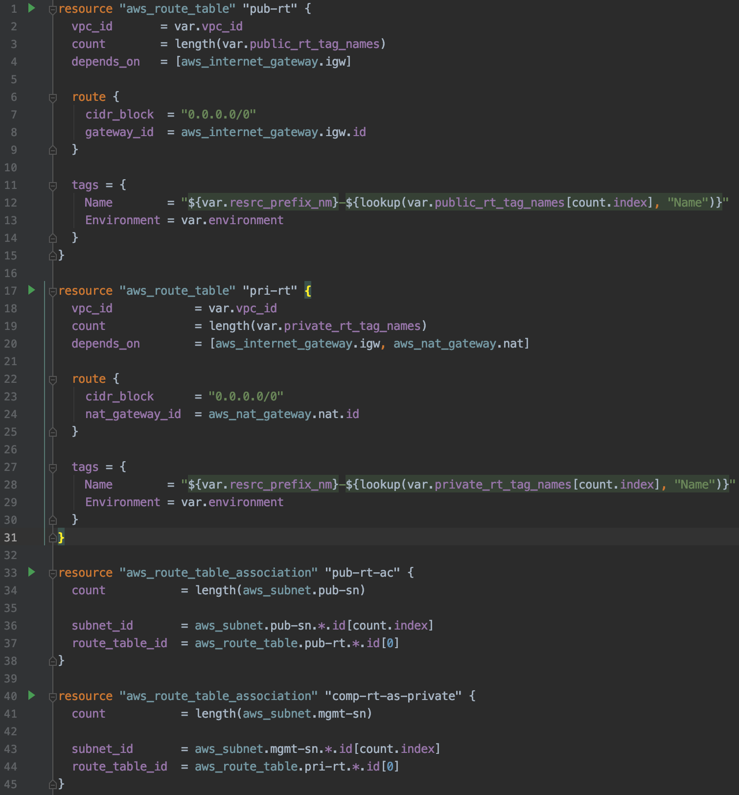
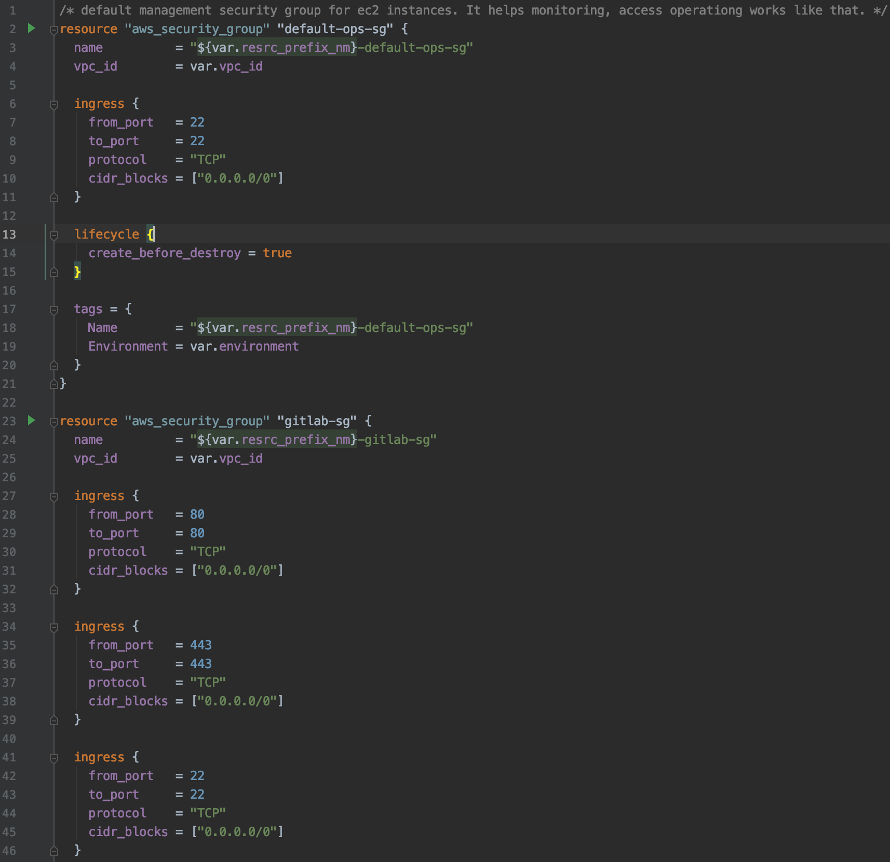
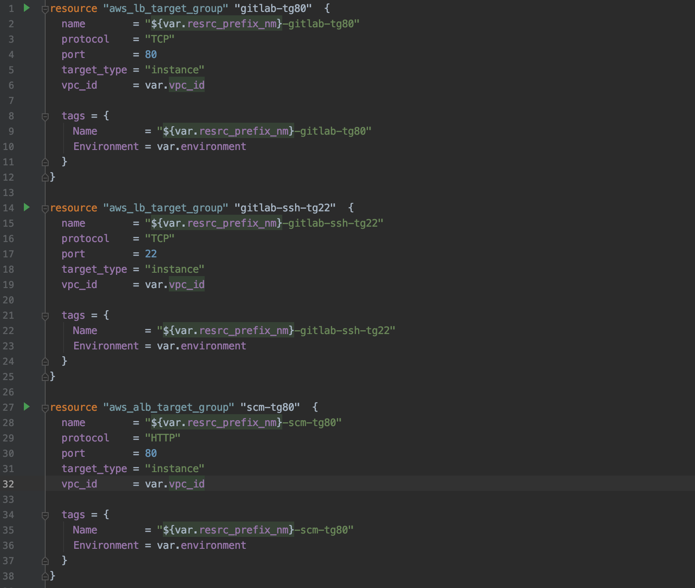

## **Services**  
#### comp-iac 프로젝트의 공통 모듈을 제외한 다양한 **resource**로 구성됩니다.
##### (`eip`, `igw`, `nat`, `route-table`, `sg`, `subnet`, `tg`, `vars`, `outputs`)
---
### 1. Subnet  

>
### 2. Route table  

>
### 3. Security group  
 
 >
### 4. Target group  
 